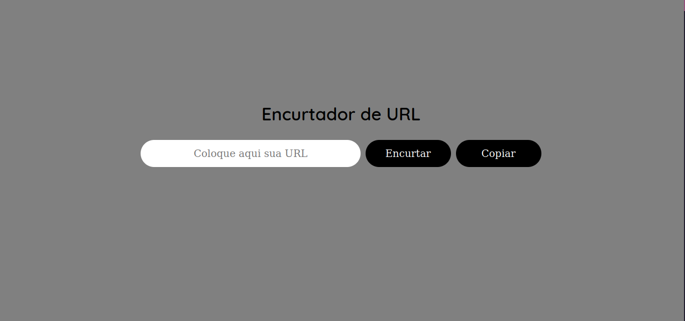

<h1 align="center"> Encurtador de Links </h1>

<h3 align="center">
  <a href="https://shaversh1an.github.io/Encurtador-de-Links/" Acesse Meu App</a>
</h3>

  

## 🚀 Tecnologias

Esse projeto foi desenvolvido com as seguintes tecnologias:

- HTML e CSS
- JavaScript
- GitHub

## 💻 Projeto

Um encurtador de links para que possamos encaminhar links complexos com mais facilidade.
